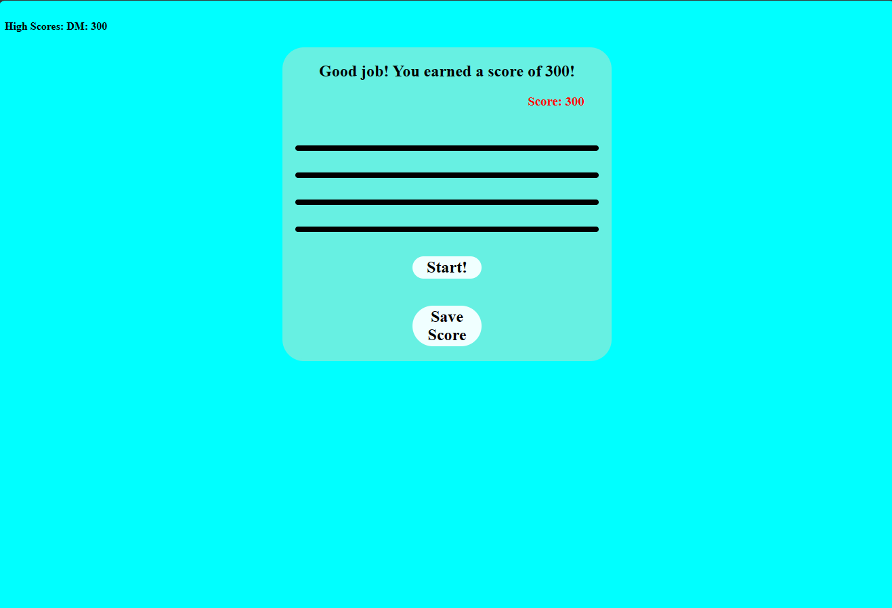

# Code-Quiz

This is a code quiz featuring 5 questions with 4 answers each alongside a 60 second time limit. When a user correctly answers a question, they gain 100 points and move onto the next question. When a user answers a question incorrectly, they gain no points and lose 10 seconds on the timer. At the end, if the user wishes, they may press the Save Score button, which will prompt them for their initials. Their score will then be saved at the top of the screen.

Link to the Github repo: https://github.com/DominikMcVay/Code-Quiz

Link to the deployed website: https://dominikmcvay.github.io/Code-Quiz/

